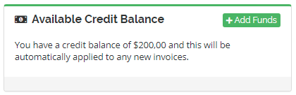

# WHMCS - Client Credit Balance (Multilingual)

### Intro

Adding a "Credit Balance" panel to the client area home page.

## Installation

To install this script you need to place client_credit_balance.php file in WHMCS-ROOT/includes/hooks directory.

---

&copy; 2019 - [Ivan Petermann](https://ivanpetermann.com)